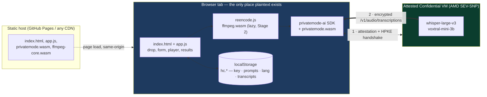
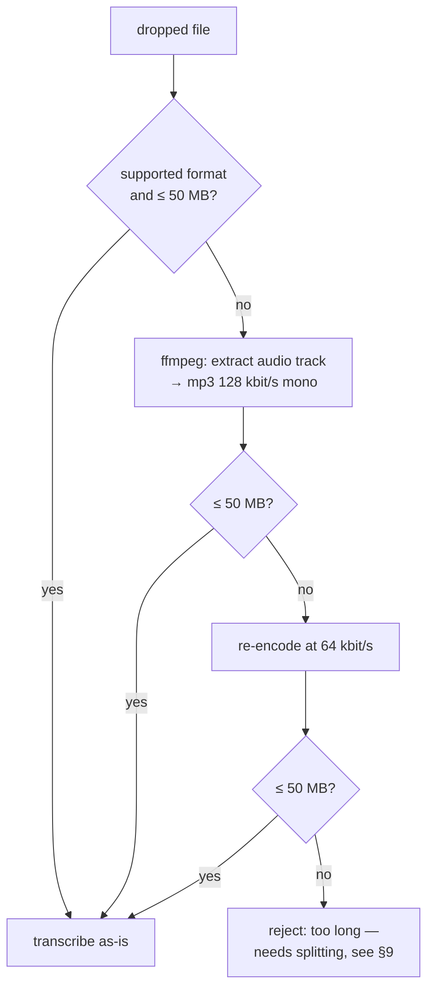

# hushscribe — Architecture

**hushscribe** (`hc`)

A **static web page** that transcribes audio and video files using
[Privatemode.ai](https://docs.privatemode.ai/) confidential-computing inference, with
per-segment timestamps synced to inline playback.

The user brings an API key, drops media onto the page, and gets a timestamped transcript
back. There is no backend of ours. Nothing leaves the tab except payloads encrypted to a
**remotely attested TEE**.

---

## 1. The claim, stated precisely

> Audio never leaves this page in plaintext. It is encrypted in the browser to a key that
> only a **hardware-attested confidential VM** holds, transcribed inside that enclave, and
> the transcript comes back encrypted. The inference provider (Edgeless Systems), the cloud
> operator, and the model host cannot read your audio or your transcript.

That is a strong claim, so the architecture has to earn it. Two halves.

### 1.1 What the TEE guarantees (Privatemode's code, not ours)

The `privatemode-ai` SDK ships the remote-attestation verifier **as a Wasm blob inside the
npm package**. Before the first request it:

1. Fetches the attestation document of the Privatemode coordinator.
2. Verifies it against a signed **manifest** — expected measurements of the CVM image, the
   model, and the serving stack.
3. Performs an HPKE handshake to establish an encryption secret **with the enclave**, not
   with an API gateway.
4. Encrypts every request and response body under that secret.

`client.verify()` returns the `manifest` it verified against. **hushscribe surfaces that in
the UI** (§5). Without showing it, the claim is marketing; with it, it is checkable.

The SDK is [reproducibly buildable from source](https://docs.privatemode.ai/reference/sdk/verify-from-source)
(`nix build .#sdk.js` against `github.com/edgelesssys/privatemode-public`, then `diff -r`
against the npm tarball). We pin the SDK version and record the expected Wasm hash so a
third party can repeat that check against the exact bytes we ship.

### 1.2 What *we* must guarantee (this repo's actual job)

The TEE protects data in transit and in use. It cannot protect a compromised browser tab.
So the security work here is almost entirely **"keep the page trustworthy"**:

| Rule | Why |
|---|---|
| **Zero third-party runtime code.** No CDN, no analytics, no Google Fonts, no tag manager. | Any third-party script reads the API key and the plaintext audio *before* encryption. This one rule carries most of the weight. |
| **Everything same-origin**, including `privatemode.wasm`. | Loading the *attestation verifier* from someone else's CDN makes the proof circular. |
| **Strict CSP** (§8). | Defence in depth, so an XSS is not automatically an exfiltration. |
| **API key stays client-side.** Never sent to our origin, never in a query string. | We have no server. There is nowhere for it to go, and that must stay true. |
| **Static hosting only.** No SSR, no edge function, no request log. | Nothing to subpoena, nothing to breach. |

### 1.3 What is explicitly *not* covered — and the UI says so

Honesty here is what makes the rest credible:

- **Metadata leaks.** The provider still sees *that* you made a request, when, from which IP,
  the ciphertext size (≈ audio duration), and which model you picked. Content is
  confidential; traffic patterns are not.
- **Your browser is the trust anchor.** A malicious extension, a compromised device, or an
  XSS in this page defeats everything. The TEE cannot help there.
- **`dangerouslyAllowBrowser: true` is required** (§3.2). Its usual danger — a *server's* key
  leaking to *end users* — does not apply, because the key owner and the user are the same
  person and the key never leaves their own browser. The residual risk is XSS and supply
  chain, which §1.2 addresses head-on. Documented, not hidden.
- **Bookmark links and data exports embed the key** (§7.2, §7.3). Convenience with a real,
  stated cost.
- **We do not verify model weights.** Privatemode's model-integrity story is theirs; we link
  it, we don't restate it as ours.

---

## 2. System shape



The dashed line is the only thing our host ever serves. The double line is the only thing
that ever leaves the tab, and it is ciphertext.

---

## 3. Components

### 3.1 Files

```
index.html            # markup + CSP meta + all styles
src/app.js            # UI, drop, storage, client lifecycle, transcribe loop
src/segments.js       # pure: segments → VTT / SRT / plain text  (unit-tested)
src/gate.js           # pure: format + size admission rules      (unit-tested)
src/reencode.js       # Stage 2 only — dynamic import(), pulls in ffmpeg.wasm
vite.config.js
package.json

test/gate.test.js         # vitest
test/segments.test.js     # vitest
test/e2e/*.spec.js        # playwright, drives the real UI
test/e2e/fake-client.js   # canned transcription responses (never shipped, §6.2)
.github/workflows/ci.yml
```

`segments.js` and `gate.js` exist as separate modules **for one reason: they are the logic
worth testing without a browser.** Everything else is DOM wiring that Playwright covers.
That is the whole design rationale for the file split — not layering for its own sake.

**Skipped:** a framework, a router, a state library, a CSS framework. The UI is a form, a
dropzone, a player, and a list.

### 3.2 Client lifecycle

```js
import { PrivatemodeAI } from 'privatemode-ai';

const client = new PrivatemodeAI({
  apiKey,
  dangerouslyAllowBrowser: true,          // required in browsers; see §1.3
  browserWasmURL: './privatemode.wasm',   // same-origin, never a CDN
  expectedWasmHash: WASM_SHA256,          // pinned at build time
});

const { manifest } = await client.verify();   // rendered as proof in the UI (§5)
```

Then a refresh loop, because the encryption secret expires:

```js
// ponytail: naive fixed interval. Switch to expiresAtUnix-driven scheduling if
// sessions ever run long enough for a refresh to be missed.
setInterval(() => client.refreshSecret().catch(showError), 5 * 60_000);
```

`verify()` runs once per session on key entry, behind an explicit user action, so opening a
bookmark link does not silently spend a request.

**Skipped:** `exportSecret()` / `importSecret()` secret caching across reloads. It trades a
~1 s handshake for a long-lived secret sitting in `localStorage` — a bad deal for a
security-first app. Revisit only if reload latency is measured to be a real problem.

### 3.3 Transcription call — always timestamped

```js
const transcript = await client.audio.transcriptions.create({
  model,                            // 'whisper-large-v3' (default) | 'voxtral-mini-3b'
  file,                             // File / Blob straight from the drop event
  language,                         // REQUIRED — see below
  prompt,                           // optional vocabulary / style bias
  response_format: 'verbose_json',  // → transcript.segments[{ start, end, text }]
});
```

> ⚠️ **`verbose_json` makes `language` mandatory.** The Privatemode docs state that setting
> `language` is a *prerequisite* for `verbose_json`. Because hushscribe always wants
> timestamps, the language field is a **required input**, not an optional refinement — it
> cannot fall back to auto-detection. The UI enforces this: the transcribe button stays
> disabled until a language is chosen, seeded from `hc.lang` or `en` on first run.

Files are processed **one at a time, in order.** Sequential is simpler, gives honest
progress, and avoids hammering rate limits.

**Skipped:** parallel workers, retry with backoff, a job-queue abstraction. Add retry when a
real transient failure is observed; add concurrency when someone complains about wall time
on a 20-file batch.

---

## 4. Media handling — staged

### Backend constraints (hard, from Privatemode)

| Constraint | Value |
|---|---|
| Formats | `flac` `mp3` `mp4` `mpeg` `mpga` `m4a` `ogg` `wav` `webm` |
| Max size | **50 MB** per request |
| Max duration | **1 hour** of decoded audio per request |

### Stage 1 — pass-through only

```
accept if  extension ∈ supported  AND  size ≤ 50 MB
else       reject with a specific reason
```

No transcoding, no ffmpeg in the bundle. A working app in a fraction of the code. Rejection
messages name the actual problem (`".mkv is not supported"`, `"68 MB exceeds the 50 MB
limit"`) so Stage 2's value is obvious before it exists.

This admission logic lives in `gate.js` and is the single easiest thing in the project to
unit-test — table-driven, no browser, no network.

### Stage 2 — re-encode fallback

Triggered only when Stage 1 would reject. Lazy `import('./reencode.js')`, so users who never
need it never download ffmpeg.



This is exactly the path an `.mp4` screen recording takes: video track discarded, audio
re-encoded, transcribed. 128 kbit/s mono holds ~52 minutes under the size limit; at
64 kbit/s the **1-hour decode limit** binds instead, which is why the last branch cannot be
fixed by more compression.

`ffmpeg.wasm` core files are **vendored and served same-origin** — same rule as §1.2. It
touches plaintext audio, so it is not coming from a CDN.

**Skipped:** bit rates between 128 and 64, VBR tuning, format-aware heuristics. Two attempts
cover the realistic range; the docs' own advice is "avoid low bit rates".

---

## 5. UI

Single screen, top to bottom:

1. **Trust banner.** Before a key is entered: the claim from §1 plus links to the
   [attestation docs](https://docs.privatemode.ai/security/attestation/overview) and
   [SDK source verification](https://docs.privatemode.ai/reference/sdk/verify-from-source).
   After `verify()` succeeds: the verified **manifest digest**, rendered as the proof — *this
   specific enclave measurement is where your audio went* — plus a one-line link to §1.3's
   limits. The disclosure is part of the claim, not a footnote behind a toggle.
2. **API key** — password field, "Verify & save", saved/cleared state.
3. **Model** — `whisper-large-v3` (default) / `voxtral-mini-3b`.
4. **Language** — required (§3.3), remembered.
5. **Prompt** — textarea plus saved prompts (save / pick / delete).
6. **Dropzone** — full-page drop target, also click-to-browse `<input type="file" multiple>`.
7. **Results** — one card per file (§5.1).
8. **Data** — export all / clear all (§7.3).

### 5.1 Timestamped result card

Each finished file renders as:

- A native `<video>` or `<audio>` element sourced from `URL.createObjectURL(file)` — the
  original dropped file, still local, never re-uploaded.
- **Captions via a native `<track>`.** `segments.js` renders the segments to WebVTT once;
  that VTT is attached as `<track default>` and the browser draws the subtitles itself. No
  caption library, no render loop.
- A **clickable segment list** — `[00:01:23] spoken words here`. Clicking a row seeks the
  player; a `timeupdate` listener highlights the active row. That listener is the only
  bespoke sync code in the feature, roughly fifteen lines.
- Export buttons: `.vtt`, `.srt`, `.txt`, `.json` — all generated from the same segments
  array by `segments.js`.

Using the browser's own caption renderer instead of a subtitle library is the whole trick
here: WebVTT is a native platform feature and it is already exactly the format we need.

**Skipped:** waveform preview, speaker colours, editable transcripts, progress percentages
(the API does not stream — a spinner is the honest indicator).

---

## 6. Testing

The goal is **one command locally, the same command in CI, and no API key required to run
any of it.**

```bash
npm test          # unit + e2e, headless
npm run test:unit # vitest only — fast, no browser
npm run test:e2e  # playwright only
npm run test:ui   # playwright --ui, for debugging a failing GUI test
```

### 6.1 Two layers, chosen for what they actually cover

| Layer | Tool | Covers |
|---|---|---|
| **Unit** | **Vitest** | `gate.js` admission rules (every format × size boundary), `segments.js` VTT/SRT/text rendering, timestamp formatting, storage export/import shape. |
| **GUI / e2e** | **Playwright** | Real Chromium against the real built page: drop a fixture file, fill the form, assert the segment list renders, click a segment and assert the player seeks, click export and assert the downloaded bytes, clear-all and assert `localStorage` is empty. |

Vitest is free — Vite is already the build tool, so it is config-free and shares the same
module resolution. Playwright is the one genuinely new dependency, and it is unavoidable:
GUI testing needs a browser driver.

**Skipped:** a component-testing layer, snapshot tests, jsdom-based DOM tests. Pure logic
goes to Vitest, real DOM goes to a real browser, and there is no useful middle.

### 6.2 The seam that makes GUI tests possible without a key

E2E tests cannot hold a real API key or hit a real TEE. hushscribe needs exactly **one line**
of production code to be testable:

```js
// src/app.js — the only test-facing hook in shipped code
const makeClient = globalThis.__HC_CLIENT ?? ((opts) => new PrivatemodeAI(opts));
```

Playwright supplies the fake from the test side via `page.addInitScript()`:

```js
// test/e2e/fake-client.js — lives in test/, never bundled, never deployed
await page.addInitScript(() => {
  globalThis.__HC_CLIENT = () => ({
    verify: async () => ({ manifest: { digest: 'sha256:fixture' } }),
    refreshSecret: async () => {},
    audio: { transcriptions: { create: async () => ({
      text: 'hello world',
      segments: [
        { start: 0.0, end: 1.5, text: 'hello' },
        { start: 1.5, end: 3.0, text: 'world' },
      ],
    })}},
  });
});
```

Why this and not a `?mock=1` URL flag or network interception:

- **No mock code ever ships.** The fake lives entirely in `test/`. There is no dead branch in
  the production bundle to audit, and nothing to accidentally leave enabled — which matters
  more here than in a normal app, given §1.2.
- **No faking ciphertext.** Intercepting `api.privatemode.ai` would mean forging
  HPKE-encrypted responses. Stubbing at the client boundary sidesteps that entirely.
- **Zero added attack surface.** An attacker who can set a global on your page can already do
  anything; the hook grants nothing new.

A separate `@smoke`-tagged Playwright spec exercises the *real* SDK end-to-end. It is skipped
unless `HC_API_KEY` is present in the environment, so it runs on demand locally and on a
scheduled CI job with a repository secret — never on pull requests from forks.

### 6.3 GitHub Actions

One workflow, one job, identical to the local commands:

```yaml
# .github/workflows/ci.yml
on: [push, pull_request]
jobs:
  test:
    runs-on: ubuntu-latest
    steps:
      - uses: actions/checkout@v4
      - uses: actions/setup-node@v4
        with: { node-version: 22, cache: npm }
      - run: npm ci
      - run: npm run test:unit
      - run: npm run build
      - run: npx playwright install --with-deps chromium
      - run: npm run test:e2e          # playwright starts `vite preview` itself
      - uses: actions/upload-artifact@v4
        if: failure()
        with: { name: playwright-report, path: playwright-report/ }
```

Playwright's `webServer` config runs `vite preview` against `dist/`, so **e2e tests hit the
real production bundle**, not a dev server with different module semantics. Same locally,
same in CI, no branching on `process.env.CI`.

**Skipped:** a matrix across browsers and OSes, visual regression snapshots, coverage
gating. Chromium on Linux catches the bugs this app will actually have. Widen the matrix
when a Safari-specific bug is reported, not in anticipation of one.

---

## 7. Persistence and data control

All `localStorage`, prefix `hc.`, one key per concern.

| Key | Holds |
|---|---|
| `hc.apiKey` | API key |
| `hc.prompts` | named prompts, array |
| `hc.lang` | last used language code |
| `hc.model` | last used model |
| `hc.transcripts` | last **20** results — `{ name, model, lang, at, text, segments }` |

```js
// ponytail: localStorage caps around 5 MB and stores strings only. Segments roughly
// triple a transcript's size. Move to IndexedDB if the 20-entry cap starts hurting.
```

Quota errors are caught and reported, never swallowed — silently losing a transcript the
user believes is saved is a data-loss bug, and those do not get simplified away.

### 7.1 Export all data

One button → one `hushscribe-export-<ISO date>.json` file:

```json
{
  "app": "hushscribe",
  "version": 1,
  "exportedAt": "2026-08-30T12:00:00Z",
  "apiKey": null,
  "prompts": [...],
  "lang": "en",
  "model": "whisper-large-v3",
  "transcripts": [ { "name": "...", "at": "...", "text": "...", "segments": [...] } ]
}
```

Plain `Blob` + `URL.createObjectURL` + a synthetic `<a download>`. No File System Access API
— it is Chromium-only and this needs no directory picker.

**The API key is excluded by default.** A checkbox — *"include API key in export"* — opts in,
next to a plain warning that the export becomes a credential file the moment it is ticked.
Exports are far more likely to be emailed or synced than `localStorage` ever was.

The `version` field exists so a future import path can recognise the shape. **Import is not
built** — export covers backup and migration, and nobody has asked to restore yet.

### 7.2 Bookmarkable key link

```
https://host/path/#key=<apikey>
```

**Fragment, never a query string.** A fragment is not sent to the server, does not appear in
`Referer` headers, and is never written to an access log. On load: read it, persist it,
`history.replaceState()` to strip it from the address bar immediately.

The "create bookmark link" button renders the anchor **only on explicit click**, beside a
plain-language warning: the key lands in browser history, in synced bookmarks, and in
anything that can read either.

### 7.3 Clear all data

One button, one confirm dialog, removes every `hc.*` key and revokes any live object URLs.
Individual clear buttons stay next to each section — API key, prompts, transcripts — so
dropping the history does not also cost you the key.

**Skipped:** encrypting the key at rest in `localStorage`. Any key the page can derive, an
attacker running in the page can derive. Obfuscation that looks like security is worse than
none.

---

## 8. Build & deploy

```bash
npm run build      # vite build → dist/, fully static
```

Vite exists for one reason: the SDK is ESM with a peer dependency and a Wasm sidecar, and we
refuse to resolve any of that over a CDN at runtime (§1.2). The build copies
`privatemode.wasm` (and, from Stage 2, the ffmpeg core) into `dist/` and records the Wasm
SHA-256 for `expectedWasmHash`.

`dist/` deploys to GitHub Pages or any static host. No environment variables, no secrets in
CI for the default pipeline, no runtime configuration.

### CSP

Set as a `<meta http-equiv>` so it works on hosts with no header control, and as a real
header where the host allows it:

```
default-src 'none';
script-src 'self' 'wasm-unsafe-eval';
style-src 'self' 'unsafe-inline';
img-src 'self' data:;
media-src 'self' blob:;
connect-src 'self' https://api.privatemode.ai <manifest-cdn-host>;
worker-src 'self' blob:;
base-uri 'none';
form-action 'none';
```

`media-src blob:` is required for the object-URL player in §5.1; `wasm-unsafe-eval` is
unavoidable, since both the attestation verifier and ffmpeg are WebAssembly.

> **TODO before first release:** run the app once with devtools open and pin the exact
> manifest-CDN host the SDK fetches from, plus any host the ffmpeg worker needs. A CSP with a
> guessed host in it is a CSP that gets loosened in a panic on launch day.

---

## 9. Future outlook

Neither of these is scheduled. Both are written down with their real blocker so the decision
to build is made on evidence, not vibes.

### Speaker diarization — *blocked upstream*

"Who said what" is the most-requested feature transcription products get, and hushscribe
cannot ship it cheaply today:

- The Privatemode API is OpenAI-transcriptions-compatible, and that API has **no diarization
  parameter**. There is nothing to pass.
- Doing it client-side means a speaker-embedding model (pyannote-class) compiled to Wasm —
  hundreds of megabytes, and a second model to keep honest, in a page whose entire value is
  that its supply chain is small and auditable. That trade is bad at the current price.

**The lazy path is to wait.** If Privatemode adds a diarization field, this becomes a
request-parameter change plus a speaker column in the segment list — a day of work. Revisit
when the API gains one, or when a user need is concrete enough to justify the bundle.

### Splitting on silence — *needed only past one hour*

Required only for recordings over ~1 hour, because no bit rate defeats the decode-duration
limit (§4). Would need `ffmpeg silencedetect` to cut on natural pauses, sequential
transcription of each chunk, per-chunk timestamp offsets folded back into one segment list,
and the tail of chunk *n*'s transcript passed as the `prompt` of chunk *n+1* to carry names
and sentence flow across boundaries.

Real work, for a case Stage 2 already reports clearly. **Build it when someone actually drops
a two-hour recording.**

---

## 10. Decisions, one line each

| Decision | Why |
|---|---|
| No backend | A backend that touches the audio would void the claim. There is nothing for it to do. |
| No framework | One screen, one form, one list. |
| Vite, not raw `<script>` + importmap | ESM + peer dep + Wasm sidecar, all of which must be same-origin. |
| Always `verbose_json` | Timestamps are a core feature, so pay the cost of a required language field once. |
| Native `<track>` + WebVTT for captions | The browser already renders subtitles. No caption library. |
| Vitest + Playwright, nothing between | Pure logic without a browser, real DOM in a real browser, no jsdom middle ground. |
| One-line `__HC_CLIENT` seam | Testable GUI with zero mock code in the shipped bundle. |
| E2E runs against `dist/` via `vite preview` | Tests the artifact that actually deploys. |
| `localStorage`, not IndexedDB | Five small values and a capped list. Marked for upgrade. |
| Export excludes the key by default | An export file travels; `localStorage` does not. |
| Key in URL *fragment* | Never reaches a server or a log. A query string would. |
| Sequential transcription | Honest progress, no rate-limit games, less code. |
| ffmpeg lazy-loaded | ~30 MB most users will never need. |
| Two re-encode attempts, then stop | Past 64 kbit/s the duration limit binds, not the size limit. |
| Ship Stage 1 before Stage 2 | Stage 1 is a working product; Stage 2 widens the input set. |

---

## 11. References

- [Privatemode JavaScript SDK](https://docs.privatemode.ai/reference/sdk/) — `npm i privatemode-ai`
- [SDK client API](https://docs.privatemode.ai/reference/sdk/client) — `PrivatemodeAIOptions`, `verify()`, `refreshSecret()`
- [Verify the SDK from source](https://docs.privatemode.ai/reference/sdk/verify-from-source)
- [Speech-to-text guide](https://docs.privatemode.ai/guides/stt/) — formats, limits, `language`, `prompt`, `verbose_json`
- [Models](https://docs.privatemode.ai/models/overview) — `whisper-large-v3`, `voxtral-mini-3b`
- [Remote attestation](https://docs.privatemode.ai/security/attestation/overview) — the manifest and evidence
