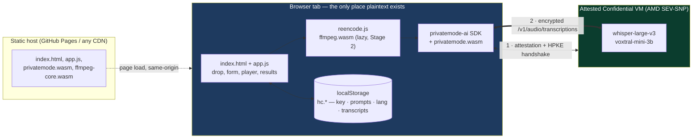
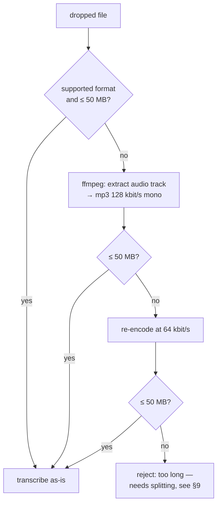

# hushscribe — Architecture

**hushscribe** (`hc`)

A **static web page** that transcribes audio and video files using
[Privatemode.ai](https://docs.privatemode.ai/) confidential-computing inference, with
per-segment timestamps synced to inline playback.

The user brings an API key, drops media onto the page, and gets a timestamped transcript
back. There is no backend of ours. Nothing leaves the tab except payloads encrypted to a
**remotely attested TEE**.

> **This project supplies a UI and none of the cryptography.** The attested confidential
> VMs, the attestation verifier, the end-to-end encryption, and the models are
> [Privatemode](https://www.privatemode.ai/), built by
> [Edgeless Systems](https://www.edgeless.systems/), a German company. Everything §1 claims
> is true because of their work; this repo's job (§1.2) is to avoid undermining it.
> Transcription is billed by them per audio minute (§5.2).

---

## 1. The claim, stated precisely

> Audio never leaves this page in plaintext. It is encrypted in the browser to a key that
> only a **hardware-attested confidential VM** holds, transcribed inside that enclave, and
> the transcript comes back encrypted. The inference provider (Edgeless Systems), the cloud
> operator, and the model host cannot read your audio or your transcript.

That is a strong claim, so the architecture has to earn it. Two halves.

### 1.1 What the TEE guarantees (Privatemode's code, not ours)

The `privatemode-ai` SDK ships the remote-attestation verifier **as a Wasm blob inside the
npm package**. Before the first request it:

1. Fetches the attestation document of the Privatemode coordinator.
2. Verifies it against a signed **manifest** — expected measurements of the CVM image, the
   model, and the serving stack.
3. Performs an HPKE handshake to establish an encryption secret **with the enclave**, not
   with an API gateway.
4. Encrypts every request and response body under that secret.

`client.verify()` returns the `manifest` it verified against. **hushscribe surfaces that in
the UI** (§5). Without showing it, the claim is marketing; with it, it is checkable.

The manifest has **no single "digest" field**. Its real shape — the SDK's `manifest.d.ts`
and the [reference](https://docs.privatemode.ai/reference/sdk/manifest) — is:

```
{ Policies:              { <policyHash>: { SANs, WorkloadSecretID, Role? } },
  ReferenceValues:       { snp: [{ ProductName, TrustedMeasurement, MinimumTCB, ... }] },
  SeedshareOwnerPubKeys: [ ... ] }
```

`ReferenceValues.snp[].TrustedMeasurement` is the **SEV-SNP launch measurement**: 96 hex
characters identifying the exact confidential-VM image. That is the enclave identity worth
showing. `src/manifest.js` reads it, and additionally computes SHA-256 over
`client.manifestBytes` — the raw bytes, never a re-serialised object, because the SDK warns
JSON round-tripping can alter them and a digest nobody can reproduce is noise.

The SDK is [reproducibly buildable from source](https://docs.privatemode.ai/reference/sdk/verify-from-source)
(`nix build .#sdk.js` against `github.com/edgelesssys/privatemode-public`, then `diff -r`
against the npm tarball). We pin the SDK version and record the expected Wasm hash so a
third party can repeat that check against the exact bytes we ship.

### 1.2 What *we* must guarantee (this repo's actual job)

The TEE protects data in transit and in use. It cannot protect a compromised browser tab.
So the security work here is almost entirely **"keep the page trustworthy"**:

| Rule | Why |
|---|---|
| **Zero third-party runtime code.** No CDN, no analytics, no Google Fonts, no tag manager. | Any third-party script reads the API key and the plaintext audio *before* encryption. This one rule carries most of the weight. |
| **Everything same-origin**, including `privatemode.wasm`. | Loading the *attestation verifier* from someone else's CDN makes the proof circular. |
| **Strict CSP** (§8). | Defence in depth, so an XSS is not automatically an exfiltration. |
| **API key stays client-side.** Never sent to our origin, never in a query string. | We have no server. There is nowhere for it to go, and that must stay true. |
| **Static hosting only.** No SSR, no edge function, no request log. | Nothing to subpoena, nothing to breach. |

### 1.3 What is explicitly *not* covered — and the UI says so

Honesty here is what makes the rest credible:

- **Metadata leaks.** The provider still sees *that* you made a request, when, from which IP,
  the ciphertext size (≈ audio duration), and which model you picked. Content is
  confidential; traffic patterns are not.
- **Your browser is the trust anchor.** A malicious extension, a compromised device, or an
  XSS in this page defeats everything. The TEE cannot help there.
- **`dangerouslyAllowBrowser: true` is required** (§3.2). Its usual danger — a *server's* key
  leaking to *end users* — does not apply, because the key owner and the user are the same
  person and the key never leaves their own browser. The residual risk is XSS and supply
  chain, which §1.2 addresses head-on. Documented, not hidden.
- **Bookmark links and data exports embed the key** (§7.2, §7.3). Convenience with a real,
  stated cost.
- **We do not verify model weights.** Privatemode's model-integrity story is theirs; we link
  it, we don't restate it as ours.

### 1.4 Showing the verifier's hash — an audit aid, not a defence

The expanded proof row displays the SHA-256 of `privatemode.wasm`. It is worth being precise
about what that does and does not buy, because it is easy to mistake for a security control.

**It is not a defence.** A page that had been tampered with would display whatever hash the
tamperer chose. A self-reported hash cannot detect a compromised self, and no amount of
displaying it changes that.

**The enforcement is elsewhere, and it is real.** `expectedWasmHash` is pinned into the
bundle at build time and checked by the SDK against the bytes it actually instantiates. A
mismatch throws before the module runs — it fails closed, with no degraded mode.

**What displaying it adds is auditability.** A reader can compare the running value against a
[reproducible build](https://docs.privatemode.ai/reference/sdk/verify-from-source) of the SDK
without opening devtools, and can tell which build is live. That fits the standing rule that
every claim on the page should be checkable. It is cheap — the value already exists as a
build-time constant — so it is worth showing, and worth labelling honestly rather than
dressing up as protection.

---

## 2. System shape



The dashed line is the only thing our host ever serves. The double line is the only thing
that ever leaves the tab, and it is ciphertext.

---

## 3. Components

### 3.1 Files

```
index.html                  # markup only — no inline styles or scripts (§8.1)
src/app.js                  # UI, storage, client lifecycle, transcribe loop
src/gate.js                 # pure: format + size admission        (39 unit tests)
src/segments.js             # pure: VTT/SRT/text, prompt budget    (40 unit tests)
src/pricing.js              # pure: per-minute rates, estimates    (29 unit tests)
src/manifest.js             # pure: SNP measurement, manifest hash (22 unit tests)
src/style.css               # all styles; hashed and minified by Vite
src/reencode.js             # stage 2 — dynamic import(), pulls in ffmpeg.wasm

vite.config.js              # base path, wasm plugin, CSP injection, dev-key mapping
playwright.config.js        # default suite; excludes @smoke
playwright.smoke.config.js  # opt-in real-enclave suite

test/gate.test.js           # vitest
test/segments.test.js       # vitest
test/pricing.test.js        # vitest
test/manifest.test.js       # vitest, against a real captured manifest
test/fixtures/manifest.json # a genuine manifest from cdn.confidential.cloud
test/e2e/app.spec.js        # playwright, drives the real UI      (26 tests)
test/e2e/fake-client.js     # stand-in client + generated fixtures (never shipped)
test/e2e/smoke.spec.js      # @smoke — real key, real enclave, real money

.github/workflows/ci.yml
.github/workflows/deploy.yml
```

`segments.js` and `gate.js` exist as separate modules **for one reason: they are the logic
worth testing without a browser.** Everything else is DOM wiring that Playwright covers.
That is the whole design rationale for the file split — not layering for its own sake.

`style.css` moved out of `index.html` (where §3.1 originally put it) once the CSP became
real: Vite hashes and minifies a linked stylesheet, and `style-src 'self'` forbids the
inline `<style>` block that would otherwise have to carry it.

Result cards carry a **Redo** button that re-runs the same file with whatever model,
language, and prompt are currently selected — the usual reason to redo being a wrong
language (§5.1).

**Redo lives on the result card and nowhere else.** The first attempt put it in history too,
backed by a session-only `Map` of dropped files. That was working against the design: history
stores text and never the media (§5.3), so the button could only work for entries from the
current tab and had to hide itself the rest of the time — a control whose availability the
user could not predict. Keeping it where the `File` is genuinely in scope removed the cache,
the conditional rendering, and the explanation they both needed. The boundary was already
correct; the button was on the wrong side of it.

**Skipped:** a framework, a router, a state library, a CSS framework. The UI is a form, a
dropzone, a player, and a list.

### 3.2 Client lifecycle

```js
import { PrivatemodeAI } from 'privatemode-ai';

const client = new PrivatemodeAI({
  apiKey,
  dangerouslyAllowBrowser: true,                                 // required in browsers; §1.3
  browserWasmURL: `${import.meta.env.BASE_URL}privatemode.wasm`, // same-origin, never a CDN
  expectedWasmHash: __WASM_SHA256__,                             // pinned at build time
});

const { manifest } = await client.verify();   // rendered as proof in the UI (§5)
```

Then a refresh loop, because the encryption secret expires:

```js
// ponytail: naive fixed interval. Switch to expiresAtUnix-driven scheduling if
// sessions ever run long enough for a refresh to be missed.
setInterval(() => client.refreshSecret().catch(showError), 5 * 60_000);
```

`verify()` runs on key entry and **automatically on load whenever a key is already stored**,
so the page is ready to take a file instead of demanding a click that has only one sensible
answer. Attestation is a handshake, not an inference request, so it costs nothing but a round
trip.

It is not free of consequence, though: **opening the page now contacts Privatemode**, where
before it was silent until you acted. No audio and no transcript are involved — it is the
same class of metadata already disclosed in §1.3 (that you made a request, when, from which
IP) — but the trigger moved from your click to page load, and that is worth stating rather
than letting it pass as a UX tweak.

**Skipped:** `exportSecret()` / `importSecret()` secret caching across reloads. It trades a
~1 s handshake for a long-lived secret sitting in `localStorage` — a bad deal for a
security-first app. Revisit only if reload latency is measured to be a real problem.

### 3.3 Transcription call — timestamped when it can be

```js
const res = await client.audio.transcriptions.create({
  model,                                        // 'whisper-large-v3' | 'voxtral-mini-3b'
  file,                                         // File / Blob from the drop event
  ...(language && { language }),                // optional
  ...(prompt && { prompt }),                    // optional, ≤ 224 tokens (§3.4)
  response_format: language ? 'verbose_json' : 'json',
});
```

Only `model` and `file` are required by the API. `language` is optional — but the reference
adds: *"`verbose_json` requires setting `language`."* Since timestamps come only from
`verbose_json`, that produces one coupling worth stating precisely:

| Language | `response_format` | You get |
|---|---|---|
| set | `verbose_json` | `segments[{start, end, text}]` → captions, seek, `.vtt` / `.srt` |
| empty | `json` | `text` only — auto-detected language, no timestamps |

**hushscribe degrades rather than demands.** Leaving language on auto-detect is a legitimate
choice the API supports, so the UI does not block on it; it explains what the choice costs
and takes the plain-text path. One consequence to keep honest: a result card with no
segments offers only `.txt` and `.json`, because there are no timestamps to write into a
subtitle file.

Auto-detect is still worth discouraging on quality grounds — the docs note a wrong guess
degrades both accuracy and latency — but that is advice, not a gate.

### 3.4 Prompt budget

Whisper accepts at most **224 prompt tokens** and silently discards the remainder, so an
over-long prompt fails invisibly: no error, just a partly-ignored instruction. The only
useful signal is an early one, shown live under the field:

| Characters | State |
|---|---|
| ≤ 300 | green |
| 301–360 | amber — "nearing the 224-token limit" |
| > 360 | red — "only the first 224 tokens are used" |

Counted in **characters, not tokens**, because a real token count means shipping a
tokenizer. The thresholds are deliberately conservative: 224 tokens is roughly 900 English
characters, so warning at 300 fires long before truncation actually bites. That is the right
direction to be wrong in — a prompt this long is already past the point of being a useful
style hint, and a false alarm costs nothing while silent truncation costs a transcript.

```js
// ponytail: character thresholds, no tokenizer. Swap in a real count only if
// someone hits truncation while the indicator still reads green.
```

Files are processed **one at a time, in order.** Sequential is simpler, gives honest
progress, and avoids hammering rate limits.

**Skipped:** parallel workers, retry with backoff, a job-queue abstraction. Add retry when a
real transient failure is observed; add concurrency when someone complains about wall time
on a 20-file batch.

---

## 4. Media handling — staged

### Backend constraints (hard, from Privatemode)

| Constraint | Value |
|---|---|
| Formats | `flac` `mp3` `mp4` `mpeg` `mpga` `m4a` `ogg` `wav` `webm` |
| Max size | **50 MB** per request |
| Max duration | **1 hour** of decoded audio per request |

### Stage 1 — pass-through only

```
accept if  extension ∈ supported  AND  size ≤ 50 MB
else       reject with a specific reason
```

No transcoding, no ffmpeg in the bundle. A working app in a fraction of the code. Rejection
messages name the actual problem (`".mkv is not supported"`, `"68 MB exceeds the 50 MB
limit"`) so Stage 2's value is obvious before it exists.

This admission logic lives in `gate.js` and is the single easiest thing in the project to
unit-test — table-driven, no browser, no network.

### Stage 2 — re-encode fallback

Triggered only when Stage 1 would reject. Lazy `import('./reencode.js')`, so users who never
need it never download ffmpeg.



This is exactly the path an `.mp4` screen recording takes: video track discarded, audio
re-encoded, transcribed. 128 kbit/s mono holds ~52 minutes under the size limit; at
64 kbit/s the **1-hour decode limit** binds instead, which is why the last branch cannot be
fixed by more compression.

`ffmpeg.wasm` core files are **vendored and served same-origin** — same rule as §1.2. It
touches plaintext audio, so it is not coming from a CDN.

> ⚠️ **Single-threaded ffmpeg core only.** The multi-threaded build (`@ffmpeg/core-mt`) needs
> `SharedArrayBuffer`, which needs cross-origin isolation via `Cross-Origin-Opener-Policy`
> and `Cross-Origin-Embedder-Policy` **response headers**. GitHub Pages cannot set headers
> (§8.1), so hushscribe uses plain `@ffmpeg/core`. Re-encoding is a few times slower and runs
> in a Worker so the UI stays responsive.
>
> The usual workaround — `coi-serviceworker`, a service worker that fakes those headers — is
> **rejected**: it is third-party code with full read access to the page, which is exactly
> what §1.2 forbids. Faster transcoding is not worth weakening the one rule the security
> claim rests on.

**Skipped:** bit rates between 128 and 64, VBR tuning, format-aware heuristics. Two attempts
cover the realistic range; the docs' own advice is "avoid low bit rates".

---

## 5. UI

Single screen, top to bottom:

1. **The claim**, from §1 — the headline, and one set-apart line naming what confidential
   computing adds over ordinary encryption: data stays unreadable *while it is being used*.
2. **Proof row.** One line, collapsed by default: a green check, the CPU product, and the
   first eight characters of the enclave measurement — `✓ Genoa · ea6a6655`. Expanding it
   (a native `<details>`, same idiom as
   history) gives the full measurement, the verification time, and links to the
   [attestation docs](https://docs.privatemode.ai/security/attestation/overview) and
   [SDK source verification](https://docs.privatemode.ai/reference/sdk/verify-from-source).

   Earlier this was a full-width panel with the digest set large, on the theory that the
   proof *is* the product. It read as clutter: a 71-character hash is not something anyone
   reads, and sizing it like a headline made the page feel heavier without making it more
   credible. Eight characters are enough to recognise a measurement you have seen before;
   the rest is one click away for the one time you actually compare it. Being checkable
   matters, being loud about it does not.

   Colour carries one meaning each: **green is verified** (this row, the header chip), blue
   stays interactive (buttons, links, the active segment).
3. **API key** — password field, "Verify & save", saved/cleared state.
4. **Model** — `whisper-large-v3` (default) / `voxtral-mini-3b`.
5. **Language** — optional, remembered. The empty option reads *"auto-detect (no
   timestamps)"*, so the cost of leaving it blank is on the control itself rather than in
   help text (§3.3).
6. **Prompt** — textarea plus saved prompts (save / pick / delete), with the live budget
   indicator (§3.4).
7. **Dropzone** — full-page drop target, also click-to-browse `<input type="file" multiple>`.
8. **Results** — one card per file (§5.1).
9. **History** — the last 20 transcripts (§5.3).
10. **Data** — export all / clear all (§7.3).

### 5.1 Timestamped result card

Each finished file renders as:

- A native `<video>` or `<audio>` element sourced from `URL.createObjectURL(file)` — the
  original dropped file, still local, never re-uploaded.

  **Which of the two is decided by probing the file, not by its name.** `.webm`, `.mp4` and
  `.ogg` are containers that may carry audio only; an audio-only `.webm` rendered as
  `<video>` paints an empty black viewport above the controls, which is exactly what
  shipped. `probeMedia()` loads metadata into a detached `<video>` and reads
  `videoWidth`/`videoHeight` — zero means no video track. `gate.js` deliberately exposes no
  `isVideo()`, because an extension names a container and cannot describe its contents.
- **Captions via a native `<track>`.** `segments.js` renders the segments to WebVTT once;
  that VTT is attached as `<track default>` and the browser draws the subtitles itself. No
  caption library, no render loop.
- A **clickable segment list** — `[00:01:23] spoken words here`. Clicking a row seeks the
  player; a `timeupdate` listener highlights the active row. That listener is the only
  bespoke sync code in the feature, roughly fifteen lines.
- Export buttons: `.vtt`, `.srt`, `.txt`, `.json` — all generated from the same segments
  array by `segments.js`.

Using the browser's own caption renderer instead of a subtitle library is the whole trick
here: WebVTT is a native platform feature and it is already exactly the format we need.

Each result and history entry also offers **Copy**, which puts the plain text on the
clipboard. Chromium does not reject `clipboard.writeText` when the document lacks focus — it
leaves the promise pending forever — so the handler races it against a 2 s timeout and always
reports an outcome rather than going silent.

**Skipped:** waveform preview, speaker colours, editable transcripts, progress percentages
(the API does not stream — a spinner is the honest indicator).

### 5.2 Cost estimate

Privatemode bills **per audio minute**, so the price of a job is knowable the moment the
browser reads the file's duration — long before the transcript returns. That makes an
estimate cheap to show and dishonest to omit.

| Model | EUR / min | One hour |
|---|---|---|
| `whisper-large-v3` | 0.014 | ≈ €0.84 |
| `voxtral-mini-3b` | 0.004 | ≈ €0.24 |

Three rules keep the number trustworthy:

- **Every figure carries its date** (`September 2026`) and links to
  [privatemode.ai/pricing](https://www.privatemode.ai/pricing). Rates move; a stale number
  should look stale rather than quietly lie. `RATES` is frozen, and a unit test asserts the
  published values, so changing what users are quoted takes a deliberate edit.
- **Duration is probed independently of playback.** A file we decline to render inline may
  still be priceable, so `probeDuration()` reuses the visible player when there is one and
  falls back to a detached element otherwise, with a 5 s timeout.
- **No duration, no estimate.** When the browser cannot decode the container the line is
  omitted entirely. An estimate nobody can check is worse than none. Likewise amounts under
  a cent read *"under €0.01"*, never `€0.00`, which would say free.

Dropping a file before pressing **Verify** now verifies first and then transcribes: dropping
a file is an unambiguous request, and making someone click twice for it was friction with no
safety value. A missing key still stops the flow, and a failed attestation still aborts
before anything is sent.

**Skipped:** a confirmation gate before spending. The estimate appears while the request is
still in flight, and a modal on every file would punish batch use. Revisit if someone
reports a surprising bill.

### 5.3 History

The last 20 transcripts, newest first, as native `<details>` rows — no accordion script, no
disclosure library. Each expands to the timestamped segment list plus the same four export
buttons and a per-entry delete.

**Media files are never stored.** They exist as an object URL for exactly as long as the tab
that received them, and nothing writes them to disk. So history entries have **no player**,
and the same `segmentList()` that renders seek buttons in a live result card renders plain rows
here — one function, one branch on whether a player exists. The UI says this out loud rather
than leaving a user to wonder why yesterday's transcript has no audio: the absence is the
feature.

This makes the storage asymmetry explicit and intentional: **text persists, audio never
does.** A transcript is small, useful later, and already left the enclave. A recording is
large, is the sensitive artifact, and has no reason to outlive the tab.

---

### 5.4 Compact view

One header toggle switches between **comfortable** (default) and **compact**, remembered in
`hc.view`. Compact makes the page **~58% shorter** (2951px → 1236px, measured).

It is driven entirely by CSS from a `data-view` attribute on `<html>`, so the JavaScript only
flips an attribute and a label. What gets hidden is decided by one marker class, `prose`, on
the teaching material: the hero copy, the walkthrough, and the four help disclosures.

Compact additionally drops descriptions and status chatter (`.note:not(.warn)`) and the
dropzone blurb. The **API key field hides once a key is stored** (`data-key="saved"`): it is
a question, and it stops needing to be asked once answered.

**The header status chip stays in both views.** An earlier pass hid it in compact as a
duplicate of the proof row, which was wrong: the header is `position: sticky`, so once the
results scroll past, the chip is the *only* place `unverified` / `sealed` is still on screen.
The proof row is the detail; the chip is the persistent indicator. Compact only shrinks it. A
test scrolls to the footer and asserts the chip is still in the viewport.

**What compact never hides:** the wrong-language warning, the per-minute rate, the
attestation row, and any error. `prose` marks explanation, not anything a user needs in order
to judge what the tool is about to do. **A denser layout must not become a less honest one.**
The warning gets *shorter*, not absent — a `.dense` one-liner replaces the paragraph — because
the temptation to drop a warning for being long is exactly what §1.3 exists to resist. E2e
tests assert each of these.

Hiding the field needs a way back, so the proof row carries an **Edit key** button in compact
— and only there, and only once a key is stored: in the full view, or with nothing saved, the
field is already on screen and the button would point at something visible. It sets
`data-key="editing"`, reveals the panel, and focuses the input with its contents selected.
Verifying a new key returns the state to `saved`, folding the panel away again. There is no
separate save; **Verify & save** already is one.

The button sits inside `<summary>`, so its handler calls `preventDefault()` and
`stopPropagation()` — otherwise every click would expand the attestation detail as a side
effect. A test asserts the disclosure stays shut.

One safety interlock: a failed verification sets `data-key="none"`, so a stored key that has
stopped working brings the field back even in compact. Otherwise a bad key would be
unfixable without first discovering the view toggle.

**Why `public/view-init.js` exists.** The CSP is `script-src 'self'` with no `'unsafe-inline'`
(§8.1), so the usual anti-flash trick — a tiny inline script in `<head>` — is unavailable.
Instead a real file is loaded as a classic, render-blocking script in `<head>`, where it runs
before the body is parsed. Without it, a compact user would watch the roomy layout paint and
then collapse on every single load. It is the one place in this project where a
render-blocking request is the right call, and it is thirteen lines.

### 5.5 Help for non-technical users

The intended user is a therapist, journalist, clinician, or lawyer with a recording they
currently cannot transcribe anywhere — not a developer. The page originally failed them at
the very first step: it demanded a "Privatemode API key" and did not say where to get one.

No tour library, no modal wizard, no separate help page nobody clicks. Three things instead:

**A way in.** Every mention of the API key links to `portal.privatemode.ai`. The single
highest-value fix in this section, and it is one anchor tag.

**A three-step walkthrough**, as a `<details>` above the form: get a key → verify → drop a
file. It is **open on first visit and collapsed afterwards**, driven by whether a key has
ever been saved:

```js
$('guide').open = !load(K.key, '');
```

No dismissed-flag to store, nothing to go stale, and someone who clears their data gets the
introduction again — which is exactly when they need it. Numbered, because this genuinely is
a sequence: order carries information the reader needs.

**Plain-language disclosures** next to each piece of jargon — *"Where do I get this?"*,
*"Which should I pick?"*, *"Why does the language matter?"*, *"What goes in here?"* — using
the same native `<details>` idiom as history and the proof row. Expert users never open them;
the page stays uncluttered for both audiences.

Labels were rewritten for the same reason. `whisper-large-v3` became **"Whisper large-v3 —
best accuracy"**; the model IDs still appear in history metadata where they are useful. The
biggest change is `prompt`, which is AI jargon describing a mechanism rather than a purpose:

| Before | After |
|---|---|
| "Prompt — bias the model toward your vocabulary" | "Names and spellings *(optional)*" |
| placeholder: *"Transcript of a product meeting discussing Privatemode, vLLM…"* | placeholder: *"Yusuf Okonkwo, Dr. Bergström, the Halvorsen case, MRI, T-cell count"* |

The new placeholder teaches the feature by showing it. Someone reading the old one had to
already know what a prompt was to guess why they might write one.

The security explanations get the same treatment — "sealed machine", "scrambled here on your
device" — while §1's precise wording stays in the proof row's expanded detail for readers who
want it. Both are true; they are pitched at different readers.

---

## 6. Testing

The goal is **one command locally, the same command in CI, and no API key required to run
any of it.**

```bash
npm test          # unit + e2e, headless
npm run test:unit # vitest only — fast, no browser
npm run test:e2e  # playwright only
npm run test:ui   # playwright --ui, for debugging a failing GUI test
```

### 6.1 Two layers, chosen for what they actually cover

| Layer | Tool | Covers |
|---|---|---|
| **Unit** | **Vitest** | `gate.js` admission rules (every format × size boundary), `segments.js` VTT/SRT/text rendering, timestamp formatting, prompt-budget thresholds (§3.4), storage export shape. |
| **GUI / e2e** | **Playwright** | Real Chromium against the real built page: drop a fixture file, fill the form, assert the segment list renders, click a segment and assert the player seeks, click export and assert the downloaded bytes, clear-all and assert `localStorage` is empty. |

Vitest is free — Vite is already the build tool, so it is config-free and shares the same
module resolution. Playwright is the one genuinely new dependency, and it is unavoidable:
GUI testing needs a browser driver.

**Skipped:** a component-testing layer, snapshot tests, jsdom-based DOM tests. Pure logic
goes to Vitest, real DOM goes to a real browser, and there is no useful middle.

### 6.2 The seam that makes GUI tests possible without a key

E2E tests cannot hold a real API key or hit a real TEE. hushscribe needs exactly **one line**
of production code to be testable:

```js
// src/app.js — the only test-facing hook in shipped code
const makeClient = globalThis.__HC_CLIENT ?? ((opts) => new PrivatemodeAI(opts));
```

Playwright supplies the fake from the test side via `page.addInitScript()`:

```js
// test/e2e/fake-client.js — lives in test/, never bundled, never deployed
await page.addInitScript(() => {
  globalThis.__HC_CLIENT = () => ({
    verify: async () => ({ manifest: { digest: 'sha256:fixture' } }),
    refreshSecret: async () => {},
    audio: { transcriptions: { create: async () => ({
      text: 'hello world',
      segments: [
        { start: 0.0, end: 1.5, text: 'hello' },
        { start: 1.5, end: 3.0, text: 'world' },
      ],
    })}},
  });
});
```

Why this and not a `?mock=1` URL flag or network interception:

- **No mock code ever ships.** The fake lives entirely in `test/`. There is no dead branch in
  the production bundle to audit, and nothing to accidentally leave enabled — which matters
  more here than in a normal app, given §1.2.
- **No faking ciphertext.** Intercepting `api.privatemode.ai` would mean forging
  HPKE-encrypted responses. Stubbing at the client boundary sidesteps that entirely.
- **Zero added attack surface.** An attacker who can set a global on your page can already do
  anything; the hook grants nothing new.

A separate `@smoke` spec exercises the *real* SDK against a real enclave, transcribing the
speeches in `test-data/`. It lives behind its own `playwright.smoke.config.js`, and the
default config excludes `@smoke` outright.

**Having a key is deliberately not enough to opt in.** The first version skipped only when
no key was present — which meant any developer with a working `.env` would have `npm test`
quietly spend real credit on the real API. Found by doing exactly that. Opting in is now an
explicit command:

```bash
npm run test:smoke      # playwright test -c playwright.smoke.config.js
```

Never wire this into pull-request CI: fork PRs cannot read secrets, and every run costs
money. A scheduled job with a repository secret is the right home if it ever needs one.

### 6.3 Fakes must mirror a captured response

The seam in §6.2 has one failure mode, and it bit in production. The fake returned
`{ manifest: { digest: 'sha256:…' } }`; production was written to read `manifest.digest`.
Both agreed, 24 GUI tests passed, CI was green, and the live page rendered:

```
✓(manifes
(manifest carried no digest)
```

The real manifest has never had a `digest` field. Two invented artefacts agreeing with each
other is not a test — **a fake that does not mirror the real contract tests nothing but
itself.** The seam is still right; what was missing was grounding.

So `test/e2e/fake-client.js` is now derived from a captured response, and
`test/fixtures/manifest.json` is a real manifest fetched from
`cdn.confidential.cloud/privatemode/v2/manifest.json`. `test/manifest.test.js` asserts
against those real bytes, including one test whose only job is to pin the fact that killed
us:

```js
it('has no digest field — the assumption that caused the bug', () => {
  expect('digest' in REAL).toBe(false);
});
```

The rule going forward: **when a fake stands in for someone else's API, its shape comes from
that API's types or a captured response, never from what the calling code happens to want.**
Where a fixture would be impractical, prefer the SDK's own `.d.ts` — the shape was published
all along, and reading it would have cost a minute.

A second guard now sits in the GUI suite: an assertion that the proof row never renders text
matching `manifest carried|undefined|null|NaN`. Placeholder strings should fail loudly in
CI, not quietly in front of a user.

### 6.4 What the coverage number counts

`npm run coverage` measures **only the four pure modules** — `gate`, `segments`, `pricing`,
`manifest` — currently 100% of lines and 97.75% of branches, with CI failing below
95/90/95/95 so the figure cannot quietly rot.

`app.js` is excluded on purpose. It is DOM wiring, exercised by Playwright against the real
built bundle, and Vitest cannot see any of that. Two dishonest options were available:
include it and report ~40%, which describes the tool rather than the code, or fold e2e
coverage in by instrumenting the bundle with Istanbul. The second is tempting but breaks a
standing rule — **e2e tests run against the artifact that deploys** (§6.4 below), and an
instrumented bundle is not that artifact. So the badge says *unit coverage* and this section
says what that covers.

The badge is a **shields.io endpoint** reading `dist/coverage.json`, which the deploy
publishes to our own Pages site. No Codecov, no Coveralls, no upload token, no third party
holding build data — shields only renders a document we serve ourselves. The number is
generated after the build by `scripts/coverage-badge.mjs`, which fails loudly if either the
coverage summary or `dist/` is missing rather than emitting a stale or empty badge.

### 6.5 GitHub Actions

Two workflows, both running the same commands a developer runs locally.

**`ci.yml`** — every push and PR: `npm run test:unit` → `npm run build` → **key-leak check**
→ `npm run test:e2e`. **`deploy.yml`** — `main` only: build, key-leak check, publish to Pages
(§8.1). The report is uploaded on failure.

The key-leak step is the one worth calling out:

```yaml
- name: Assert no API key reached the bundle
  run: |
    hits=$(grep -rIoE 'pm-[A-Za-z0-9_-]{12,}|[0-9a-f]{8}(-[0-9a-f]{4}){3}-[0-9a-f]{12}' dist/ | grep -v '10000000-1000-4000-8000-100000000000' || true)
    if [ -n "$hits" ]; then
      echo "$hits"
      echo "::error::An API-key-shaped string is present in dist/. Refusing to continue."
      exit 1
    fi
```

It turns §8.2's policy into an enforced invariant — but only once it matches the keys that
actually exist. **The first version of this check could never have fired.** It matched
`pm-`, which is what index.html's placeholder shows. A real Privatemode key is a UUID, and
`p` and `m` are not hex digits, so no real key can contain `pm-`. The negative control that
"proved" the grep worked was a `pm-` string too, so the control and the check shared one
wrong assumption — which is the only way a vacuous check survives being tested.

Both shapes are matched now, against three controls: a real key's shape, a `pm-` shape, and
the untouched bundle. The one permitted hit is openai's randomUUID polyfill template, a
published constant rather than a secret.

A check nobody has watched fail is not yet a check — and a check whose negative control was
written from the same misunderstanding as the check has still not been watched fail.

Playwright's `webServer` runs `npm run build && npm run preview`, so **e2e tests hit the real
production bundle** — the same artifact that deploys, at the same base path, with the same
CSP. Same locally, same in CI, no branching on `process.env.CI`.

`reuseExistingServer` is **off**, deliberately. With it on, a preview server left running
from earlier silently serves a stale `dist/` and skips the rebuild — tests then pass against
code that no longer exists. That cost real debugging time here. The rebuild is two seconds.

**Skipped:** a matrix across browsers and OSes, visual regression snapshots, coverage
gating. Chromium on Linux catches the bugs this app will actually have. Widen the matrix
when a Safari-specific bug is reported, not in anticipation of one.

---

## 7. Persistence and data control

All `localStorage`, prefix `hc.`, one key per concern.

| Key | Holds |
|---|---|
| `hc.apiKey` | API key |
| `hc.prompts` | named prompts, array |
| `hc.lang` | last used language code |
| `hc.model` | last used model |
| `hc.view` | `comfortable` (default) or `compact` (§5.4) |
| `hc.transcripts` | last **20** results — `{ name, model, lang, at, text, segments }` |
| `hc.ephemeral` | `true` while new transcripts are kept out of storage (§7.4) |

```js
// ponytail: localStorage caps around 5 MB and stores strings only. Segments roughly
// triple a transcript's size. Move to IndexedDB if the 20-entry cap starts hurting.
```

Quota errors are caught and reported, never swallowed — silently losing a transcript the
user believes is saved is a data-loss bug, and those do not get simplified away.

### 7.1 Export all data

One button → one `hushscribe-export-<ISO date>.json` file:

```json
{
  "app": "hushscribe",
  "version": 1,
  "exportedAt": "2026-08-30T12:00:00Z",
  "apiKey": null,
  "prompts": [...],
  "lang": "en",
  "model": "whisper-large-v3",
  "transcripts": [ { "name": "...", "at": "...", "text": "...", "segments": [...] } ]
}
```

Plain `Blob` + `URL.createObjectURL` + a synthetic `<a download>`. No File System Access API
— it is Chromium-only and this needs no directory picker.

**The API key is excluded by default.** A checkbox — *"include API key in export"* — opts in,
next to a plain warning that the export becomes a credential file the moment it is ticked.
Exports are far more likely to be emailed or synced than `localStorage` ever was.

The `version` field exists so a future import path can recognise the shape. **Import is not
built** — export covers backup and migration, and nobody has asked to restore yet.

### 7.2 Bookmarkable key link

```
https://host/path/#key=<apikey>
```

**Fragment, never a query string.** A fragment is not sent to the server, does not appear in
`Referer` headers, and is never written to an access log. On load: read it, strip it from the
address bar with `history.replaceState()`, **then ask before storing it**.

**The confirm is not politeness.** A link is written by whoever wrote the link. Any page,
mail, or message can send someone to `…/#key=<attacker key>`, and persisting that silently
would replace the stored key and bind the tab to a stranger's account — their bill, their
usage record, their metadata. Content stays confidential, since the key holder cannot decrypt
what the enclave holds, but that is the only thing that survives; in every other respect it is
a login-CSRF. So this is the one storage write in the app that asks first.

Note the asymmetry it removes. The Verify button persists a key only *after* attestation
succeeds. Until this, the fragment path persisted one before anything at all had been checked.

The strip happens either way: a declined key still must not sit in the address bar.

The "create bookmark link" button renders the anchor **only on explicit click**, beside a
plain-language warning: the key lands in browser history, in synced bookmarks, and in
anything that can read either.

### 7.3 Clear all data

One button, one confirm dialog, removes every `hc.*` key and revokes any live object URLs.
Individual clear buttons stay next to each section — API key, prompts, transcripts — so
dropping the history does not also cost you the key.

**Clearing a credential ends the session it opened.** `endSession()` drops the client, the
sealed measurement, and the refresh interval, and returns the proof row to *unverified*.
Without it, "Forget key" removed only the stored copy: the five-minute `refreshSecret()`
timer kept calling `api.privatemode.ai` with the key the user believed was gone, and the next
dropped file transcribed happily and wrote history straight back into the storage they had
just emptied. Both `clearKey` and `clearAll` call it, and `verify()`'s failure path reuses it
rather than repeating the four lines.

`hc.ephemeral` is deliberately restored after the sweep. Not saving transcripts is a
*setting*, not data, and a privacy action must not quietly hand back the less private default.

**Skipped:** encrypting the key at rest in `localStorage`. Any key the page can derive, an
attacker running in the page can derive. Obfuscation that looks like security is worse than
none.

### 7.4 Ephemeral mode

One checkbox in the history panel: *don't save new transcripts in this browser*.

Saving stays the default, and should — a transcript you cannot find again is its own kind of
data loss, and §7 exists to get your text back. But the app's whole premise is that the
recording is confidential, and until this there was no way to ask for a transcription without
the plaintext result being written to disk, where any same-origin script and anything reading
the browser profile can reach it. A warning is not a control.

The guard is on the **write**, not the render. The result card behaves exactly as it always
did for as long as the tab is open — this hides nothing from the person who asked for the
transcript. It simply never reaches storage, and a transcript that was never stored cannot
leak from storage.

Transcripts saved before the box was ticked stay until they are cleared. The checkbox governs
new writes, "Clear transcripts" governs old ones. Conflating the two would mean a privacy
toggle that silently deletes, which is a worse surprise than one that does not.

---

## 8. Build & deploy

```bash
npm run build      # vite build → dist/, fully static
```

Vite exists for one reason: the SDK is ESM with a peer dependency and a Wasm sidecar, and we
refuse to resolve any of that over a CDN at runtime (§1.2). The build copies
`privatemode.wasm` (and, from Stage 2, the ffmpeg core) into `dist/` and records the Wasm
SHA-256 for `expectedWasmHash`.

### 8.1 Hosting: GitHub Pages, free

hushscribe is served from **GitHub Pages** on the free tier. It has no backend, no database,
and no runtime configuration, so a static-file host is not a compromise — it is the whole
deployment. Cost is zero, at any usage level this app will see.

Pages is not just *adequate* here, it actively supports the claim in §1:

- **Nothing to log.** We could not retain user data if we wanted to; there is no server-side
  code to run. Static hosting is the strongest form of "we don't have your audio."
- **The deployed bytes are traceable.** Pages publishes from a public repo
  ([dhcgn/hushscribe](https://github.com/dhcgn/hushscribe)) through a public Actions run.
  Anyone can check that the page they loaded was built from the commit they audited — the
  same argument the SDK's
  [reproducible build](https://docs.privatemode.ai/reference/sdk/verify-from-source) makes
  one layer down. The page links to its own repository in the footer and from the expanded
  proof row, so the chain is walkable without leaving the app: **verify the enclave → verify
  the SDK → read this page's source.** A trust claim nobody can trace is just a slogan.
- **Free TLS**, and *Enforce HTTPS* stays on. WebAssembly, `crypto.subtle`, and object URLs
  all require a secure context, so this is a hard requirement, not a nicety.

**Honest caveat:** GitHub and its CDN see who fetched the page, when, and from which IP —
ordinary web-server metadata for the *static assets*. They never see audio or transcripts;
those go straight from the tab to `api.privatemode.ai`, encrypted (§1.3, metadata leaks).

#### What Pages forces on the design

| Constraint | Consequence |
|---|---|
| **No custom response headers.** | CSP ships as `<meta http-equiv>` (below). No `COOP`/`COEP`, hence single-threaded ffmpeg (§4). No `Strict-Transport-Security` of our own — GitHub's own HSTS on `*.github.io` covers it. |
| **Project sites live under a subpath** (`user.github.io/hushscribe/`). | Vite `base` is set from an env var, defaulting to `/hushscribe/`; a custom domain sets it to `/`. All asset URLs stay relative, including `browserWasmURL: './privatemode.wasm'`. Getting this wrong is the classic "blank page on Pages, works locally" bug — the e2e suite runs against `vite preview` with the same `base`, so CI catches it. |
| **Soft limits: 1 GB site, 100 GB/month bandwidth.** | Irrelevant for the app itself; worth remembering that the ffmpeg core alone is tens of megabytes and is served on demand. Lazy-loading it (§4) keeps typical page weight small. |
| **Jekyll processing.** | A non-issue with the artifact-based deploy below, which uploads `dist/` as-is. No `.nojekyll` needed. |

`.wasm` is served as `application/wasm`, so `WebAssembly.instantiateStreaming` works without
a fallback path.

#### Deploy workflow

Separate from CI, runs on `main` **only after tests pass**, using the official
artifact-based Pages actions — no `gh-pages` branch, no third-party deploy action:

```yaml
# .github/workflows/deploy.yml
on:
  push: { branches: [main] }
permissions:
  contents: read
  pages: write
  id-token: write
concurrency: { group: pages, cancel-in-progress: true }
jobs:
  deploy:
    environment: github-pages
    runs-on: ubuntu-latest
    steps:
      - uses: actions/checkout@v4
      - uses: actions/setup-node@v4
        with: { node-version: 22, cache: npm }
      - run: npm ci
      - run: npm run test:unit
      - run: npm run build          # BASE_PATH baked in here
      - uses: actions/upload-pages-artifact@v3
        with: { path: dist }
      - uses: actions/deploy-pages@v4
```

No repository secrets are involved: the build takes no key, and the only credential the app
ever handles is the one the user types into their own browser.

### 8.2 Development credentials

Typing an API key into every fresh browser profile gets old fast, so `.env` holds one:

```
PRIVATEMODE_AI_API_KEY=<uuid>
```

Real keys are UUIDs. The `pm-…` that used to stand here, and still stands in index.html's
placeholder, is the shape the CI grep in §6.5 was written against — see there for why that
mattered.

`.env` is gitignored, `.env.example` is committed, and the key is used for exactly one
thing: **prefilling the API key field**. It is never auto-verified and never written to
`localStorage` on the developer's behalf.

> ⚠️ **A key baked into a static bundle is a published key.** This app deploys to a public
> GitHub Pages site, so anything reachable from the built JavaScript is readable by everyone.
> The dev key must never survive `npm run build`.

Two mechanisms, one now and one later:

| | Today (no build step) | Once Vite lands |
|---|---|---|
| Source | `.env` | `.env` |
| Bridge | `node make-env.mjs` writes `env.js`, loaded by an optional `<script src="env.js">` that 404s harmlessly when absent | `VITE_PRIVATEMODE_AI_API_KEY`, read as `import.meta.env.DEV && import.meta.env.VITE_…` |
| Why it can't leak | `env.js` is gitignored and simply does not exist in `dist/` | Vite substitutes `import.meta.env.DEV` with `false` in production and dead-code-eliminates the branch |

Both are gitignored (`.env`, `.env.*`, `env.js`), with `!.env.example` re-included.

The deploy workflow (§8.1) never sees a key, so there is no path by which one reaches the
published site. **CI check, now in both workflows:** grep `dist/` for key-shaped strings and
fail the build on a hit. Cheap, and it turns a policy into an enforced invariant — provided
the pattern matches a real key, which the first version did not (§6.5).

`make-env.mjs` is deleted the day Vite arrives — it exists only to bridge a gap.

### CSP

GitHub Pages cannot set response headers, so the CSP ships as a `<meta http-equiv>` in
`index.html`. That is the real, deployed policy — not a fallback:

```
default-src 'none';
script-src 'self' 'wasm-unsafe-eval';
style-src 'self';
img-src 'self' data:;
media-src 'self' blob:;
connect-src 'self' https://api.privatemode.ai https://cdn.confidential.cloud
            https://api.trustedservices.intel.com https://kdsintf.amd.com;
worker-src 'self' blob:;
base-uri 'none';
form-action 'none';
```

`media-src blob:` is required for the object-URL player in §5.1; `wasm-unsafe-eval` is
unavoidable, since both the attestation verifier and ffmpeg are WebAssembly.

> **`frame-ancestors` does not work in a `<meta>` CSP** — it is header-only, and Pages gives
> us no headers. So clickjacking is blocked the old way, with a two-line
> `if (self !== top) { document.body.replaceChildren(...) }` guard at startup. Crude, but it
> is the entire mitigation available on this host, and an invisible iframe of a page holding
> an API key is worth blocking.

**Hosts were extracted from the SDK's Wasm binary, not guessed** — the earlier TODO here is
closed. The verifier makes its own `fetch` calls from inside Go, so they are invisible in the
JavaScript and only turn up by reading the binary:

| Host | Why |
|---|---|
| `api.privatemode.ai` | inference |
| `cdn.confidential.cloud` | the signed manifest (`/privatemode/v2`) |
| `api.trustedservices.intel.com` | Intel PCS — SGX/TDX attestation collateral |
| `kdsintf.amd.com` | AMD KDS — SEV-SNP VCEK certificates |

> ⚠️ **`style-src 'self'` forbids `style=""` attributes.** Four inline styles in `index.html`
> silently broke layout in the built page while looking perfect in dev, because the CSP is
> injected on build only. They are CSS classes now, and an e2e test fails on any console CSP
> violation — it is far too easy to reintroduce one, and dev will never tell you.

Never widen this policy to make an error disappear; narrow it if a host proves unused.

---

## 9. Future outlook

Neither of these is scheduled. Both are written down with their real blocker so the decision
to build is made on evidence, not vibes.

### Speaker diarization — *blocked upstream*

"Who said what" is the most-requested feature transcription products get, and hushscribe
cannot ship it cheaply today:

- The Privatemode API is OpenAI-transcriptions-compatible, and that API has **no diarization
  parameter**. There is nothing to pass.
- Doing it client-side means a speaker-embedding model (pyannote-class) compiled to Wasm —
  hundreds of megabytes, and a second model to keep honest, in a page whose entire value is
  that its supply chain is small and auditable. That trade is bad at the current price.

**The lazy path is to wait.** If Privatemode adds a diarization field, this becomes a
request-parameter change plus a speaker column in the segment list — a day of work. Revisit
when the API gains one, or when a user need is concrete enough to justify the bundle.

### Splitting on silence — *needed only past one hour*

Required only for recordings over ~1 hour, because no bit rate defeats the decode-duration
limit (§4). Would need `ffmpeg silencedetect` to cut on natural pauses, sequential
transcription of each chunk, per-chunk timestamp offsets folded back into one segment list,
and the tail of chunk *n*'s transcript passed as the `prompt` of chunk *n+1* to carry names
and sentence flow across boundaries.

Real work, for a case Stage 2 already reports clearly. **Build it when someone actually drops
a two-hour recording.**

---

## 10. Decisions, one line each

| Decision | Why |
|---|---|
| No backend | A backend that touches the audio would void the claim. There is nothing for it to do. |
| GitHub Pages, free tier | Free, zero-ops, no server logs to leak, and the deployed bytes trace to a public build. |
| Single-threaded ffmpeg core | Pages sets no headers → no COOP/COEP → no `SharedArrayBuffer`. Slower beats a third-party service worker. |
| `base` from an env var | Project sites live under `/hushscribe/`; a custom domain does not. E2E runs with the same `base` so CI catches it. |
| Deploy via `deploy-pages`, not a `gh-pages` branch | Official actions, no third-party deploy step touching the artifact. |
| No framework | One screen, one form, one list. |
| Vite, not raw `<script>` + importmap | ESM + peer dep + Wasm sidecar, all of which must be same-origin. |
| `verbose_json` only when a language is set | The API couples them. Degrade to plain text rather than making an optional field mandatory. |
| Prompt budget counted in characters | A tokenizer to police a 224-token cap is more code than the warning is worth. |
| Cost estimated, never gated | Billing is per audio minute, so the figure is free to compute; a modal on every file would punish batch use. |
| No duration, no price shown | An estimate nobody can check is worse than none. |
| `test-data/` versioned, excluded from CI | Real speech makes the smoke suite reproducible; a non-cone sparse checkout keeps 83 MB off every build. |
| Native `<track>` + WebVTT for captions | The browser already renders subtitles. No caption library. |
| Vitest + Playwright, nothing between | Pure logic without a browser, real DOM in a real browser, no jsdom middle ground. |
| One-line `__HC_CLIENT` seam | Testable GUI with zero mock code in the shipped bundle. |
| E2E runs against `dist/` via `vite preview` | Tests the artifact that actually deploys. |
| `localStorage`, not IndexedDB | Five small values and a capped list. Marked for upgrade. |
| History stores text, never media | The transcript is small and useful later; the recording is the sensitive artifact and has no reason to outlive the tab. |
| Native `<details>` for history rows and the proof | The browser already has a disclosure widget; one idiom for both. |
| Proof collapsed to `✓ Genoa · ea6a6655` | Eight characters identify a measurement. Nobody reads 96, and setting them large made the page heavy, not trustworthy. |
| Fakes derived from captured responses | A fake that agrees with an invented contract tests nothing but itself (§6.4). |
| Inline `<details>` help, no tour library | A tour is a third-party script with full page access (§1.2) that everyone dismisses. Disclosures cost nothing to the people who skip them. |
| Walkthrough opens iff no key was ever saved | Correct for first-timers and for anyone who cleared their data, with no dismissed-flag to store or go stale. |
| Dev key via `.env` → `env.js` | Gitignored, absent from `dist/`, and replaced by `import.meta.env.DEV` once Vite lands. |
| Export excludes the key by default | An export file travels; `localStorage` does not. |
| Key in URL *fragment* | Never reaches a server or a log. A query string would. |
| Sequential transcription | Honest progress, no rate-limit games, less code. |
| ffmpeg lazy-loaded | ~30 MB most users will never need. |
| Two re-encode attempts, then stop | Past 64 kbit/s the duration limit binds, not the size limit. |
| Ship Stage 1 before Stage 2 | Stage 1 is a working product; Stage 2 widens the input set. |

---

## 11. References

- **This project:** [github.com/dhcgn/hushscribe](https://github.com/dhcgn/hushscribe)

- [Privatemode JavaScript SDK](https://docs.privatemode.ai/reference/sdk/) — `npm i privatemode-ai`
- [SDK client API](https://docs.privatemode.ai/reference/sdk/client) — `PrivatemodeAIOptions`, `verify()`, `refreshSecret()`
- [Verify the SDK from source](https://docs.privatemode.ai/reference/sdk/verify-from-source)
- [Speech-to-text guide](https://docs.privatemode.ai/guides/stt/) — formats, limits, `language`, `prompt`
- [Speech-to-text API reference](https://docs.privatemode.ai/reference/speech-to-text/) — which fields are actually required, and the `verbose_json` ↔ `language` coupling
- [Models](https://docs.privatemode.ai/models/overview) — `whisper-large-v3`, `voxtral-mini-3b`
- [Remote attestation](https://docs.privatemode.ai/security/attestation/overview) — the manifest and evidence
