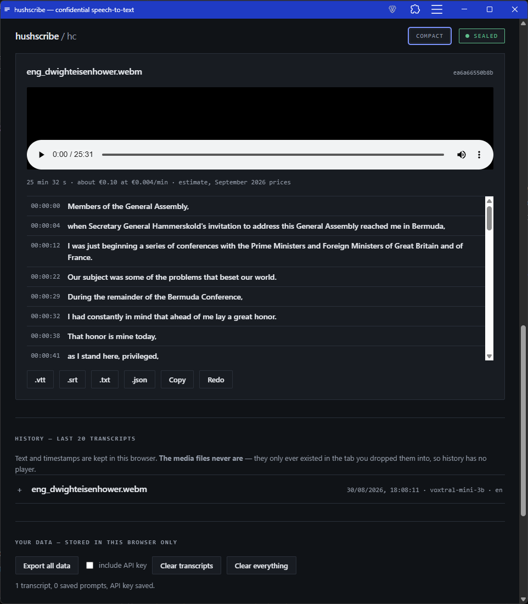
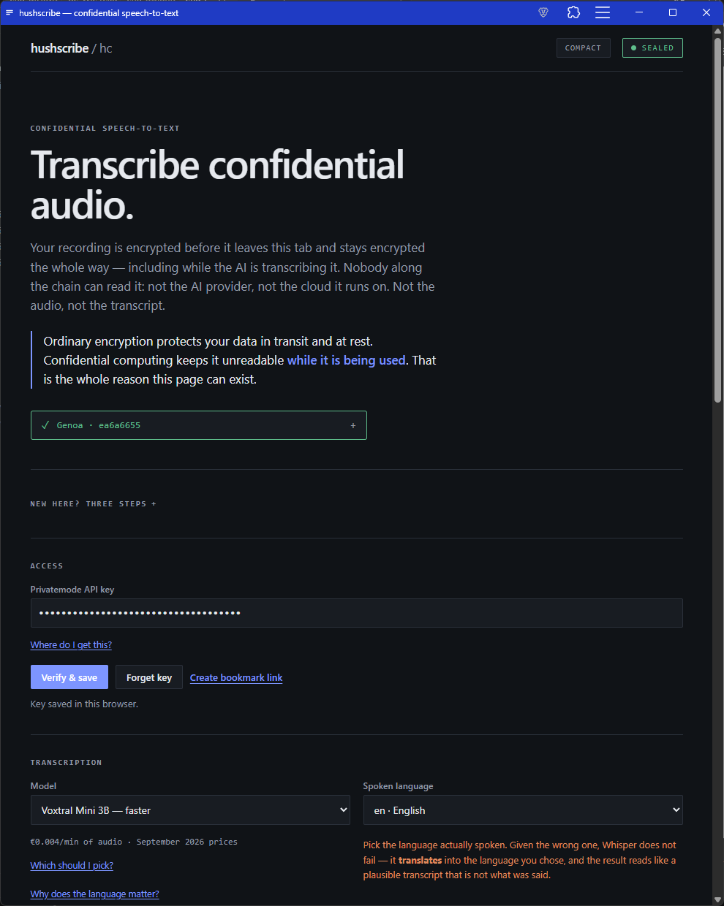
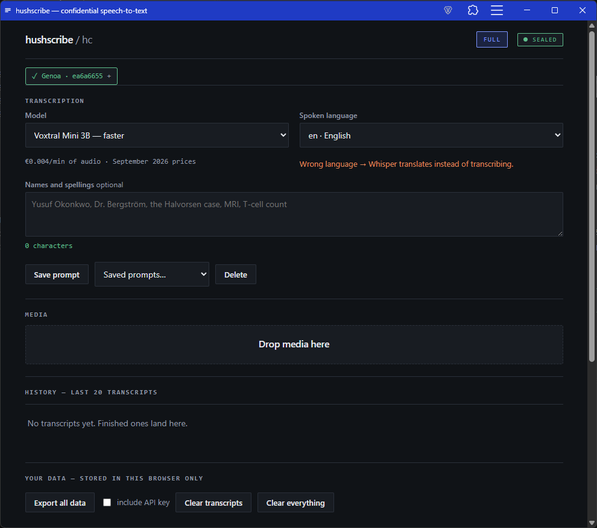
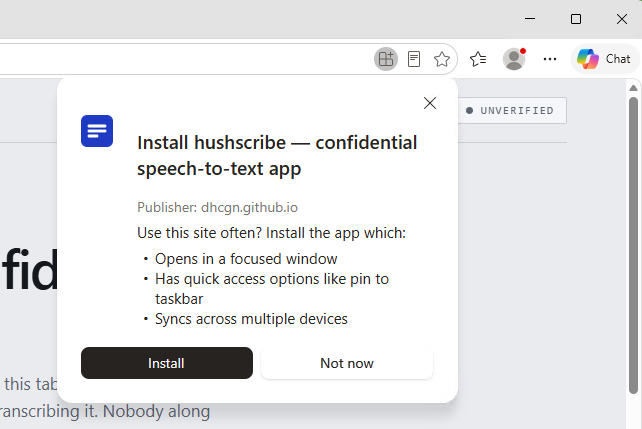
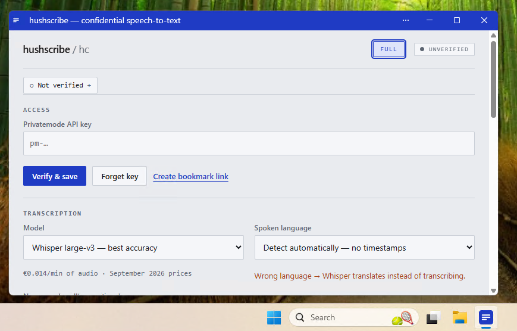

# hushscribe

**Transcribe confidential audio.** A static web page that transcribes recordings using
[Privatemode.ai](https://docs.privatemode.ai/) confidential-computing inference.

<p align="center">
  <a href="https://github.com/dhcgn/hushscribe/actions/workflows/ci.yml"></a>
  <a href="https://github.com/dhcgn/hushscribe/actions/workflows/deploy.yml"></a>
  <a href="LICENSE"></a>
  
</p>

<h2 align="center">
  <a href="https://dhcgn.github.io/hushscribe/">▶&nbsp; Click here for hushscribe</a>
</h2>

<p align="center">
  <b><a href="https://dhcgn.github.io/hushscribe/">dhcgn.github.io/hushscribe</a></b><br>
  Nothing to install and no account here &mdash; it runs in the browser tab you open it in.<br>
  Bring a <a href="https://portal.privatemode.ai">Privatemode API key</a>, drop in a file,
  get a timestamped transcript.<br>
  <sub>You pay Privatemode about &euro;0.014 per audio minute; a five-minute recording costs
  roughly seven cents.</sub>
</p>

Your recording is encrypted before it leaves the browser tab and stays encrypted the whole
way — *including while the model is transcribing it*. Nobody along the chain can read it:
not the inference provider, not the cloud it runs on. Ordinary encryption protects data in
transit and at rest; confidential computing keeps it unreadable while it is being used.

There is no backend. Bring an API key, drop a file, get a timestamped transcript.

→ **[ARCHITECTURE.md](ARCHITECTURE.md)** for how it works and why it is built this way.
→ **[AGENT.md](AGENT.md)** if you are an AI agent working on this repo.

<p align="center">
  <a href="https://dhcgn.github.io/hushscribe/">
  
  </a>
</p>

<table>
  <tr>
    <td width="50%" valign="top">
      
    </td>
    <td width="50%" valign="top">
      
    </td>
  </tr>
  <tr>
    <td valign="top">
      <b>Full view.</b> Explains itself: what confidential computing adds, where to get a
      key, which model to pick, and what a wrong language does to your transcript.
    </td>
    <td valign="top">
      <b>Compact view</b> &mdash; about 58% shorter, remembered across visits. The
      explanations go; the attestation row, the per-minute rate, and the wrong-language
      warning stay. A denser layout must not become a less honest one.
    </td>
  </tr>
</table>

---

## Built on Privatemode, by Edgeless Systems

hushscribe is a front end and nothing more. Everything that makes the claim above true —
the attested confidential VMs, the remote-attestation verifier, the end-to-end encryption,
the models — is [**Privatemode**](https://www.privatemode.ai/), built by
[**Edgeless Systems**](https://www.edgeless.systems/), a German company working on
confidential computing.

This repository contributes a browser UI and the discipline needed to keep that UI
trustworthy. It contributes none of the cryptography. Without their work there would be
nothing here worth trusting.

## What it costs

Transcription is billed by Privatemode **per audio minute**, not per file or per request:

| Model | Rate | One hour of audio |
|---|---|---|
| `whisper-large-v3` | €0.014 / min | ≈ €0.84 |
| `voxtral-mini-3b` | €0.004 / min | ≈ €0.24 |

Prices as of **September 2026**, plus VAT where applicable — see
[privatemode.ai/pricing](https://www.privatemode.ai/pricing) for current figures.
hushscribe estimates each file's cost as soon as your browser reads its length, before the
transcript comes back. hushscribe itself is free and takes no cut; you pay Privatemode
directly.

---

## Quick start

```bash
npm ci
npm run dev
```

Then open the page, paste a [Privatemode API key](https://portal.privatemode.ai), press
**Verify & save**, and drop in an audio or video file.

## Scripts

| Command | What it does |
|---|---|
| `npm run dev` | Vite dev server on :5173 |
| `npm run build` | Static build into `dist/` |
| `npm run preview` | Serve `dist/` on :4173, exactly as Pages will |
| `npm test` | Unit tests, then the GUI suite |
| `npm run test:unit` | Vitest — pure logic, no browser, fast |
| `npm run test:e2e` | Playwright against the real production bundle |
| `npm run test:ui` | Playwright's UI mode, for debugging a failing test |
| `npm run test:smoke` | **Opt-in.** Transcribes `test-data/` against a real enclave. Costs credit. |

No test needs an API key except `test:smoke`. The GUI suite injects a stand-in client at
the single seam production code exposes, so no mock code ever ships.

`test-data/` holds ~83 MB of public-domain speeches (MLK, JFK, Eisenhower, a German talk)
across every supported container, plus `.opus` files that must be *rejected*. Only
`test:smoke` reads them. **CI checks out the repo without them** — a non-cone sparse
checkout paired with a blobless clone, so the bytes are never fetched on a build.

## Local development key

```bash
cp .env.example .env      # then paste your key
```

`.env` is gitignored. It prefills the key field during `npm run dev` and enables
`test:smoke`. It is substituted with `''` in every build, and CI fails the pipeline if a
key-shaped string appears in `dist/` — a bundle published to GitHub Pages is public.

## Supported input

`flac` `mp3` `mp4` `mpeg` `mpga` `m4a` `ogg` `wav` `webm` — up to **50 MB** and **1 hour**
per file. Anything else is rejected with the reason. Automatic re-encoding is stage 2.

Set a **language** to get timestamps, clickable segments, and `.vtt` / `.srt` subtitles;
leave it on auto-detect and you get plain text. That coupling is the API's, not ours —
`verbose_json` requires a language.

## Install it as an app

The page ships a web app manifest, so it installs like a native app and runs in its own
window — no store, no packaging, the same static page either way.

<table>
  <tr>
    <td width="43%" valign="top">
      
    </td>
    <td width="57%" valign="top">
      
    </td>
  </tr>
  <tr>
    <td valign="top">
      <b>Installing.</b> On Windows, Chrome and Edge offer this from the address bar. The
      publisher shown is <code>dhcgn.github.io</code> &mdash; the same page, not a repackaged
      binary.
    </td>
    <td valign="top">
      <b>Installed.</b> Its own window and taskbar icon. It still has no backend and still
      stores everything locally; only the browser chrome has gone.
    </td>
  </tr>
</table>

**Android** — Chrome offers *Install app* from the ⋮ menu, or prompts you directly.
**iPhone and iPad** — open it in Safari, then *Share* → *Add to Home Screen*. Both give you
a home-screen icon that launches straight into the app, which is worth having if you
transcribe from your phone.

Being installed changes nothing about how it works: same encryption, same attested enclave,
same `localStorage`. It is a shortcut and a window, not a different program.

The service worker **caches nothing, deliberately**. hushscribe cannot work offline — every
transcription needs the API — so a cache would buy nothing, while a stale one could pin an
old bundle. That bundle carries the attestation verifier and its pinned hash, so a fix must
reach every client on the next load.

## What is stored

Everything lives in your browser's `localStorage` and nowhere else: the API key, saved
prompts, your last 20 transcripts. **Media files are never stored** — they exist only in
the tab you dropped them into, which is why history has no player. Export or delete it all
from the page.

## Deployment

Live at **[dhcgn.github.io/hushscribe](https://dhcgn.github.io/hushscribe/)**. Push to
`main` and Actions builds, checks, and publishes it.

**One-time setup on a fresh clone or fork:** Pages must be enabled with *Source: GitHub
Actions* before the first deploy, or `configure-pages` fails with `Get Pages site failed`.
The workflow cannot do this for you — `GITHUB_TOKEN` is refused with `Resource not
accessible by integration`.

```bash
gh api -X POST repos/<owner>/<repo>/pages -f build_type=workflow
```

Or Settings → Pages → Source: GitHub Actions.

`BASE_PATH` defaults to `/hushscribe/` for a project site — set it to `/` for a custom
domain, and keep it in step with `base` in `vite.config.js`.

## Verifying the claim

1. **The enclave** — the page shows the attested measurement it verified against.
2. **The SDK** — [reproducibly buildable](https://docs.privatemode.ai/reference/sdk/verify-from-source)
   from `edgelesssys/privatemode-public`; the build pins its Wasm SHA-256.
3. **This page** — you are reading its source. Pages publishes from this repo through a
   public Actions run, so the bytes you load trace back to a commit you can audit.

A trust claim nobody can trace is just a slogan.

## Licence

MIT
